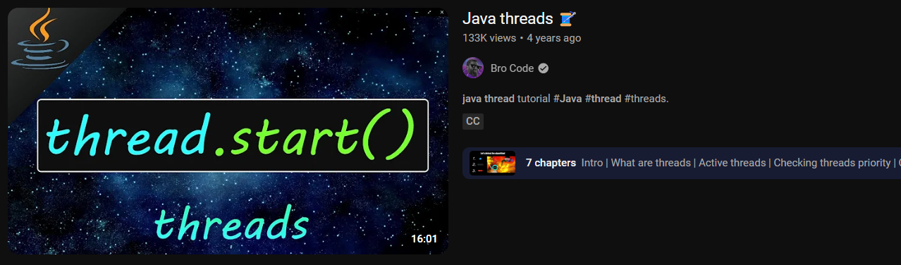

[Java threads 🧵](https://www.youtube.com/watch?v=a_LBuCx1KTE)
https://www.youtube.com/watch?v=a_LBuCx1KTE


### Code snippets

#### Via Thread
```java
MyThread thread1 = new MyThread();
thread1.start();
```

##### MyThread implementation
```java
public class MyThread extends Thread {  
    @Override  
    public void run() {  
		try {  
			// ....
			Thread.sleep(1000);  
		} catch (InterruptedException e) {  
			e.printStackTrace();  
		}  
        System.out.println("Thread #1 is finished :)");  
    }  
}
```

#### Via Runnable
```java
MyRunnable runnable1 = new MyRunnable();  
Thread thread2 = new Thread(runnable1);
thread2.start();
```

##### Runnable Implementation
```java
public class MyRunnable implements Runnable {  
    @Override  
    public void run() {  
		System.out.println("Thread #2 : " + i);  
		try {  
			// ....
			Thread.sleep(1000);  
		} catch (InterruptedException e) {  
			e.printStackTrace();  
		}
        System.out.println("Thread #2 is finished :)");  
    }  
}
```